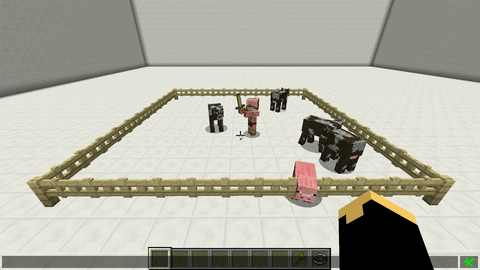

# Behavior

With this skill you can change the behavior of the pet. There are 5 possible behavior-modes:

* friendly -> don't fight, even he's attacked by anything
  * friend
* normal -> like a normal wolf
* aggressive -> attacks everythink within 15 blocks of the owner
  * aggro
* farm -> attacks every **Monster** within 15 blocks of the owner
* raid -> like normal but the pet doesn't attack players and their minions
* duel -> pets will attack other pets with aktive duel behavior within a 5 block radius

To toggle the mode type `/petbehavior [`**`normal`**`/`**`friendly`**`/`**`aggressive`**`/`**`farm`**`/`**`raid`**`/`**`duel`**`]`.

## Demonstration

