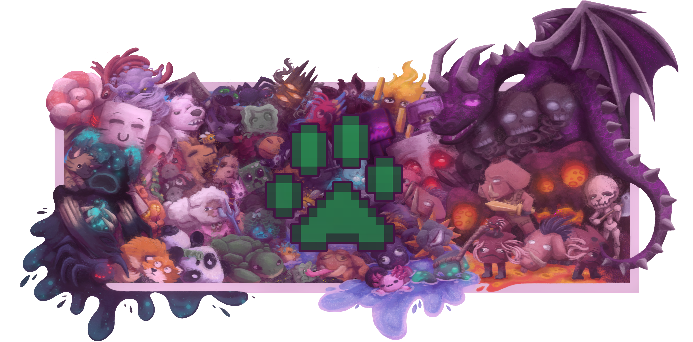

# Developer Platform

<figure><figcaption></figcaption></figure>

<h2 align="center">MyPet Wiki</h2>

Your one-stop-shop for all things MyPet

<table data-view="cards"><thead><tr><th></th><th></th><th></th><th data-hidden data-card-target data-type="content-ref"></th></tr></thead><tbody><tr><td><h4><i class="fa-paw-simple">:paw-simple:</i></h4></td><td><strong>Player Guide</strong></td><td>Learn how to capture, level up, and take care of your Pet.</td><td><a href="https://app.gitbook.com/o/cEmGiPtUi9sbvpCRqMnM/s/CLIQJgCWtTj1XV5YZsmS/">Player Guide</a></td></tr><tr><td><h4><i class="fa-gears">:gears:</i></h4></td><td><strong>Setup Guide</strong></td><td>Learn how to configure MyPet to best work for your server.</td><td><a href="https://app.gitbook.com/o/cEmGiPtUi9sbvpCRqMnM/s/bDDqqkbXYyKdy88rOP6U/">Setup Guide</a></td></tr><tr><td><h4><i class="fa-square-terminal">:square-terminal:</i></h4></td><td><strong>Developer Guide</strong></td><td>Learn how to hook into MyPet and add custom features.</td><td><a href="https://app.gitbook.com/o/cEmGiPtUi9sbvpCRqMnM/s/T0TyDfClyoU8tkVkPSvS/">Developer Guide</a></td></tr></tbody></table>

<h2 align="center">Join the MyPet Community</h2>

Join our Discord community to chat and receive support, or assist development by creating Pull Requests on GitHub.

<table data-card-size="large" data-view="cards"><thead><tr><th></th><th></th><th></th><th data-hidden data-card-target data-type="content-ref"></th></tr></thead><tbody><tr><td><h4><i class="fa-discord">:discord:</i></h4></td><td><strong>Discord</strong></td><td>Join our Discord community to post questions, get help, and chat with our community.</td><td><a href="https://discord.gg/GtcdWFw">https://discord.gg/GtcdWFw</a></td></tr><tr><td><h4><i class="fa-github">:github:</i></h4></td><td><strong>GitHub</strong></td><td>Help us make MyPet better by submitting your own code.</td><td><a href="https://github.com/MyPetORG/MyPet">https://github.com/MyPetORG/MyPet</a></td></tr></tbody></table>
