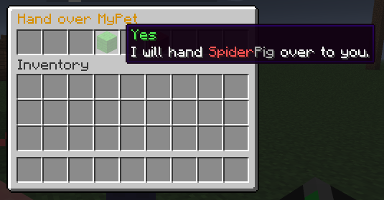
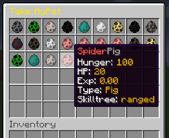

# Citizens NPC

A simple addon for _MyPet_ that adds a trait to Citizens that allows pet-owners to store their pets.

Every _WorldGroup_ has it's own storage so you can not transfer pets between _WorldGroup_s.

The Citizens **trait**s are called:

* `mypet-storage`  -&gt;  MyPet Storage
* `mypet-wallet`  -&gt;  Economy addon for the `mypet-storage` trait
* `mypet-shop`  -&gt;  Pet shop 

## Pictures

  

## Commands

* `/petadmin npc wallet [`**`Private`**`/`**`Owner`**`/`**`Bank`**`/`**`None`**`]`
  * sets the account where the money will be transfered to
    * Owner and Bank need a name as a 2nd parameter
* `/petadmin npc shop <shop name>`
  * set the shop that will be opened by the selected NPC

## Permissions

The `MyPet.petstorage.limit.<limit>` permission is shared with by `/petstore` command and the **storage/shop trait**.

```text
 - MyPet.npc.storage
 - MyPet.npc.shop

 - MyPet.petstorage.limit.<limit>
```


