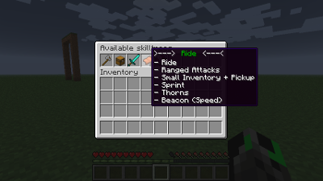

# Commands

## Legend

* Chatcommands
  * `<variable>` -&gt; **required**!
  * `[vaiable]` -&gt; optional

    Most commands have aliases like `/pi`. Use them instead the long version.

 In most cases you can also go through the command options by using the `TAB`-key. 

## MyPet Commands

### `/mypet`

* show all available _MyPet_ commands.

### `/petinfo`

* Syntax: `/petinfo [username]`
* show the following info about your or another player's pet.
  * hitpoints
  * experience
  * damage
  * owner \(only when pets isn't yours\)
  * skilltree
* alias:
  * `/pinfo`

### `/petname`

* Syntax: 
  * `/petname <new-pet-name>`
* set the name of your pet.
* owners can use colors to make the name of their pets more colorfull with this placeholder:
  * `<black>`, `<darkaqua>`, `<darkblue>`, `<darkgreen>`, `<darkred>`, `<darkpurple>`, `<gold>`, `<gray>`, `<darkgray>`, `<blue>`, `<green>`, `<aqua>`, `<red>`, `<lightpurple>`, `<yellow>`, `<white>`, `<magic>`, `<bold>`, `<strikethrough>`, `<underline>`, `<italic>`, `<reset>`

### `/petrelease`

* Syntax: `/petrelease [pet-name]`
* release your pet so you don't have a pet anymore

### `/petcall`

* teleports your pet to you.
* alias:
  * `/pc`
  * `/petc`

### `/petsendaway`

* send your pet away.
* it can be still called by using the `/petcall` command
* alias:
  * `/psa`
  * `/petsa`

### `/petrespawn`

* Syntax: `/petrespawn [`**`pay`**`or`**`show`**`or`**`auto`**`]`
* show the following info about your or another player's pet.
  * auto with an addition parameter \(Integer\) determines what the maximum time is the player want to pay for
  * Example: A player used `/petrespawn auto 10` and the pet dies and has a respawn time of 16 seconds. Now the plugin will wait until the respawntime is 10 seconds and then respawn the pet when the owner can pay the respawn fee.
* alias:
  * `/petr`
  * `/pr`

### `/petswitch`

* allows you to switch between pets.
* alias:
  * `/pswitch`

### `/petstore`

* allows you to store your active pet
* stored pets can be retrieved by the `/petswitch` command
* alias:
  * `/pstore`
  * `/pst`

### `/pettrade`

* Syntax: `/pettrade [`**`accept`**`or`**`reject`**`or`**`cancel`**`or`**`a <player name>`**`] <price>`
*  only available in premium version
* offers your current pet to another player.
  * `<price>` can be any economy price
* alias:
  * `/pett`
  * `/pt`

### `/petshop`

* Syntax: `/petshop [shopname]`
*  only available in premium version
* opens a GUI that shows the available pet shops
* alias:
  * `/petsh`
  * `/psh`

### `/petskill`

* Syntax: `/petskill [playername]`
* shows info about the skills of your pet.
* as an admin this command you can also shows info about other player's pets

### `/petadmin`

* Syntax: `/petadmin <option> [parameters...]`
* You need the _`MyPet.admin`_ permission to use this command!
* options:
  * `name`
    * set the name of a pet for a specific player
    * parameters:
      * `<ownername>`
      * `<new petname>`
  * `exp`
    * set the exp of a pet for a specific player
    * parameters:
      * `<ownername>`
      * `<new exp of the pet>`
      * \[**add**/**set**/**remove**\]
  * `respawn`
    * set/displays the respawnt time of a pet for a specific player
    * will only change the respawn time for dead pets
    * parameters:
      * `<ownername>`
      * \[new respawntime\] or \[**show**\]
  * `reload`
    * reloads the selected config file
    * parameters:
      * **`all`**
      * **`config`**
      * **`skilltrees`**
  * `skilltree`
    * changes the skilltree of a pet
    * parameters:
      * `<pet ownername>`
      * `<skilltree>`
  * `build`
    * shows the _MyPet_ version and build number
  * `create`
    * creates a new pet for a specific player
    * not usable when player has an active pet
    * use -f to create a new pet even if the player has a pet already
    * parameters:
      * \[**-f**\]
      * `<ownername>`
      * `<pettype>`
      * \[parameter\]
    * Use the TAB-key to see all possible paramerters for the selected pettype
  * `clone`
    * clones a pet from a player and gives it to another player
    * parameters:
      * `<pet ownername>`
      * `<new pet ownername>`
  * `remove`
    * deletes a pet of a specific player
    * parameters:
      * `<ownername>`
  * `cleanup`
    * deletes unused pets older than a certain amount of time
    * if no parameter is given all pets which aren't used after the upgrade to MyPet 1.1.3
    * parameters \(example\):
      * \[1Y\] \[1D\] \[1H\] \[1M\]
  * `ticket`
    * creates a ZIP file that contains all the info the developers need when you ask something on [GitHub](https://github.com/xXKeyleXx/MyPet/issues)

### `/petstop`

* orders your pet to stop attacking his target
* useless in `farm` and `aggressive` behavior modes
* alias:
  * `/ps`
  * `/pets`

### `/petchooseskilltree`

* shows all available skilltrees and lets you selects a skilltree for your pet
* alias:

  * `/pcst`
  * `/petcst`  

 

  

### `/petcapturehelper`

*  only available in premium version
* enables/disables the CaptureHelper
* alias:
  * `/pch`

### `/petoptions`

* Syntax: `/petoptions <option> [parameters...]`
* options:
  * `healthbar`
    * toggles healthbar on/off
  * `idle-volume`
    * set the volume of the idle sound pets make
    * parameters:
      * `<percent>`

## Skill Commands

### `/petinventory`

* Syntax: `/petinventory [playername]`
* opens the inventory of your pet
* opening the inventory of another player requires the _`MyPet.admin`_ permission
* alias:
  * `/pi`
  * `/peti`

### `/petpickup`

* toggles pickup of your pet on/off
*  requires Inventory with at least one row of slots 
* alias:
  * `/pp`
  * `/petp`

### `/petbehavior`

* Syntax: `/petbehavior [mode]`
* toggles the behavior your pet
* modes:
  * `friendly` -&gt; the pet will not fight even when it's attacked by anything
    * friend
  * `normal` -&gt; the pet will act like a normal wolf
  * aggressive -&gt; attacks automaticly everythink within 15 blocks of the owner
    * aggro
  * `farm` -&gt; attacks automaticly every **Monster** within 15 blocks of the owner
  * `raid` -&gt; like normal but the pet will not attack players and their minions \(wolves, ocelot, pets\)
  * `duel` -&gt; pets will attack other pets with active duel behavior within a 5 block radius
* alias:
  * `/pb`
  * `/petb`

### `/petbeacon`

* opens the beacon window of your pet
* alias:
  * `/pbeacon`
  * `/petbeacon`

