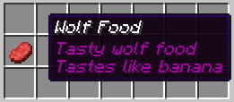

# Custom-Item-Data in Config

Since MyPet-1.1.4 it is possible to set the **item data** \(like wool color\) and **NBT data** \(like enchantments, name and lore\) for items in the MyPet config.

You have to provide the Item properties in this order:

* Item-ID/Item-Name Item-Data NBT-Data

Examples:

* `363 0 {display:{Name:"Wolf Food",Lore:["Tasty wolf food","Tastes like banana"]}}`
* `minecraft:beef 0 {display:{Name:"Wolf Food",Lore:["Tasty wolf food","Tastes like banana"]}}`

When you set the food of the wolf to this, a player needs an item that is like in this picture: 

This will allow server owners to set the food and leash items \(and some other items used by MyPet\) to items that can only be obtained by shops etc.

#### Item generators

You can also use item generators from various site like these:

* [http://mapmaking.fr/give1.12/](http://mapmaking.fr/give1.12/)
* [https://ezekielelin.com/give/](https://ezekielelin.com/give/)
* [https://minecraftcommand.science/de/custom-item-generator](https://minecraftcommand.science/de/custom-item-generator)

Just copy the generated command and remove the `/give @a`.

#### NBT data

The syntax for the NBT data is the same like in the `/give` command in _Minecraft_. You can find all possible NBT properties [here](http://www.minecraftwiki.net/wiki/Player.dat_Format#Item_structure) or just use one of the generators from above.

