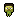

# Skill Overview

*  [Backpack](backpack.md)
*  [ Beacon](beacon.md)
*  [ Behavior](behavior.md)
*  [ Control](control.md)
*  [ Damage](damage.md)
*  [ Fire](fire.md)
*  [ Heal](heal.md)
*  [ Knockback](knockback.md)
*  [ Life](life.md)
*  [ Lightning](lightning.md)
*  [ Pickup](pickup.md)
*  [ Poison](poison.md)
*  [ Ranged](ranged.md)
*  [ Ride](ride.md)
*  [ Shield](shield.md)
*  [ Slow](slow.md)
*  [ Sprint](sprint.md)
*  [ Stomp](stomp.md)
*  [ Thorns](thorns.md)
*  [ Wither](wither.md)

