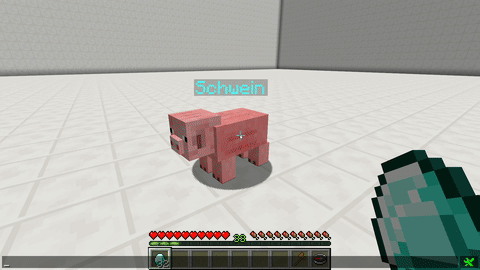

# Backpack

This skill adds a Backpack to your pet. It can be opened by using the `/petinventory` command. Items in this inventory will not be dropped when the pet dies unless it's enabled in the [skilltree](../systems/skilltrees/) skill settings.

Items [picked](pickup.md) up by your pet will be added to this inventory. Line added by skill upgrade will add 9 extra slots \(up to 54 slots\).

## Demonstration

