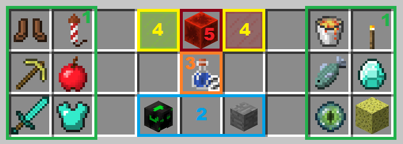
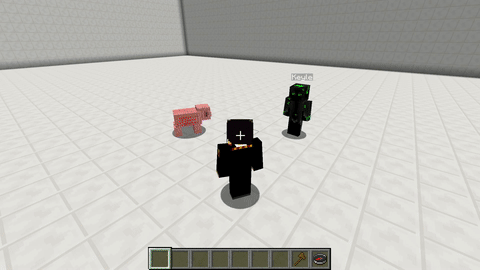

# Beacon

The Beacon skill transforms your pet in a walking and more powerfull [beacon](http://www.minecraftwiki.net/wiki/Beacon_Block). For administration of the buffs the plugin uses a custom menu \(see Beacon Buff Selection Menu\) that can be opened with the `/petbeacon` [command](../setup/commands.md#skill-commands). By default this skill consumes food when it is active, that means the [Saturation](../systems/hungersystem.md)-Value decreases continuously while the skill is active.

## Beacon Buff Selection Menu

\*\*\*\* ****

* **1** selectable buffs
* **2** target selection \(owner, party, everyone\)
* **3** remaining selectable buffs
* **4** confirm/cancel selection
* **5** power on/off

## Demonstration  

