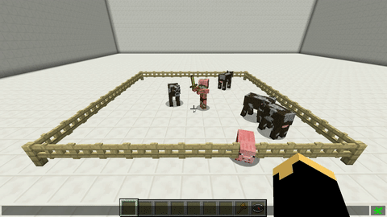

# Behavior

With this skill you can change the behavior of the pet. There are 5 possible behavior-modes:

* friendly -&gt; don't fight, even he's attacked by anything
  * friend
* normal -&gt; like a normal wolf
* aggressive -&gt; attacks everythink within 15 blocks of the owner
  * aggro
* farm -&gt; attacks every **Monster** within 15 blocks of the owner
* raid -&gt; like normal but the pet doesn't attack players and their minions
* duel -&gt; pets will attack other pets with aktive duel behavior within a 5 block radius

To toggle the mode type `/petbehavior [`**`normal`**`/`**`friendly`**`/`**`aggressive`**`/`**`farm`**`/`**`raid`**`/`**`duel`**`]`.

## Demonstration  

