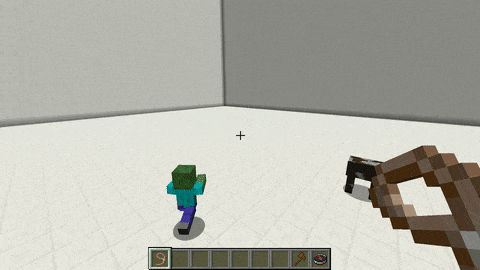

# Control

## Control

With this skill you have more control about where you pet walk and what the pet attacks. To use this you have to rightclick with the **Control item** anywhere you want the pet has to walk to. The item that is used to control the pet can be set in the config \(`Skill.Control.Item`\)

## Demonstration  

