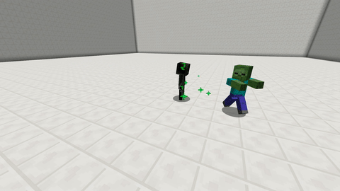

# Fire

With this skill your pet has a chance to set his target on fire for some seconds. The chance and the duration can be set via the [skilltree](../systems/skilltrees/) skill settings

## Demonstration  

