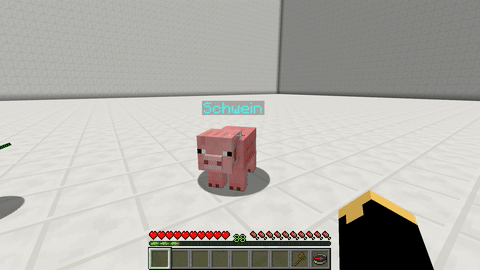

# Pickup

With this skill your pet can pickup items \(and XP\) like a player that lie on the ground. The items are added to the [backpack](backpack.md) of the pet. This skill can not be activated when the pet doesn't has the Backpack skill with at least 1 row.

Pickup can be enabled/disabled by using `/petpickup` [command](../setup/commands.md#skill-commands).

## Demonstration

