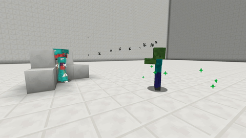

# Ranged

With this skill your pet will shot projectiles at their targets that cause damage to them.

The used projectile, rate of fire \(rounds per second\) and the damage can be set via the [skilltree](../systems/skilltrees/) skill settings.

## Projectiles

* arrow
* egg
* Wither skull
* snowball
* small fireball
* large fireball

All projectiles deal the same amount of damage that is set by the skill. The only difference is the trajectory of some projectiles.

## Demonstration  

