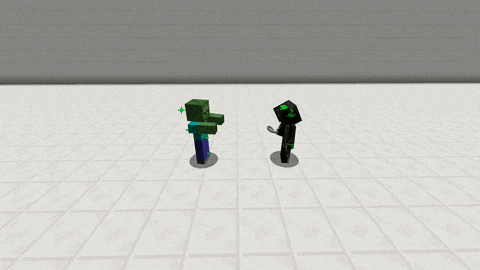

# Ride

With this skill you can ride your pet. To mount your pet rightclick your pet with the item specified in the [config.yml](../setup/configurations/config.yml.md) \(`MyPet.Skill.Ride.Item`\). The default item is a **`lead`**. The controls while riding your pet is like you would ride a horse.

## Flying

You can also fly with your pet when it's enabled by your [skilltree](../systems/skilltrees/).

The ride speed \(and the ability to fly\) can be set via the [skilltree](../systems/skilltrees/) skill settings.

Even very small speed values will increase the speed a lot, so be careful.


1 meter = 1 block


### Region Flag

_The region flag_ can be used to prevent/allow flying in certain [WorldGuard](http://dev.bukkit.org/bukkit-plugins/worldguard/) regions.

The flag is called: `mypet-fly`

## Demonstration  

