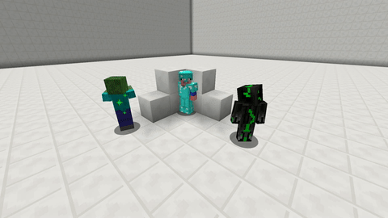

# Shield

With this skill your pet can shield \(some\) damage from you and redirect it to itself.

The chance and the percentage of the redirected damage can be set via the [skilltree](../systems/skilltrees/) skill settings.

## Demonstration  

