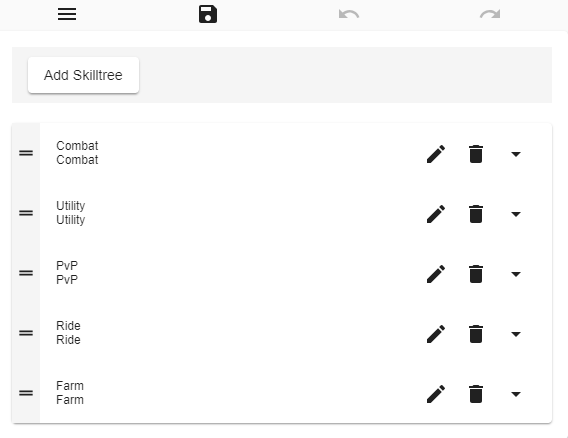
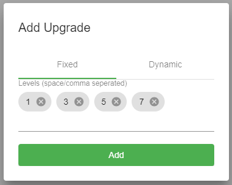
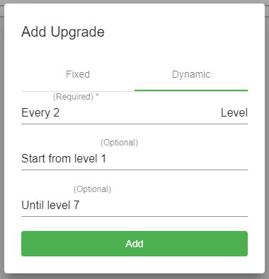

# SkilltreeCreator - Tool

The _SkilltreeCreator_ is built into the plugin and doesn't has to be downloaded separately.  
Simply doubleclick the `MyPet.jar` and a browser window will open.  
All changes made on this page will be saved to the skilltree files when you hit the **Save**-Button.  
Most parts of the _SkilltreeCreator_ should be self-explaining.

Attention! You have to use the save button at the top of the page to save the skilltrees.  
Don't close the window/tab if you have unsaved changes. They will be lost if you do so.  
If you closed the window/tab by accident you can reopen it via the icon in the tray menu.

### Skilltree list

 

In the skilltree list/overview you can create and delete skilltrees and change the order of them.  
You also have access to the menu where you can switch between languages \(only english and german for now\) and import \(legacy\) skilltrees.

### Upgrade editor

On the upgrade page you can add new upgrades for every single skill.

In order to add an upgrade have to select the skill you want to add the upgrade to from the dropdown.  
Then you click on the `Add Upgrade`-button next to the skill selection.  
In the new popup you can choose between a fixed and a dynamic level-rule.  
Fixed rules will apply the upgrade on fixed levels like 5 or 1,3,5 and 7.  
Dynamic rules can be used if you want to apply the upgrade over a certain range of levels like  
every 2 level \(2,4,6,8,10,... or 1,3,5,7,9,...\) for example.  
  
will be the same like this dynamic rule  

### Checkboxes

On certain skills you will see checkboxes. These checkboxes have three states:

* active  
* inactive  
* don't change  
  * in this state the value will not change when the upgrade is applied
  * this can be usefull if you activated something before and don't want to change that

