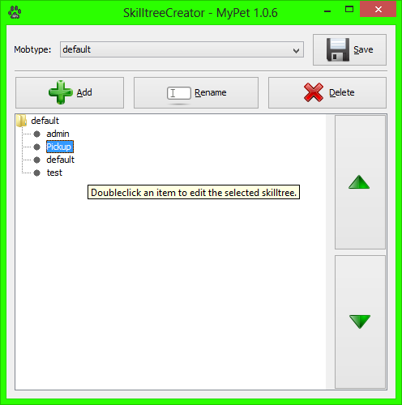
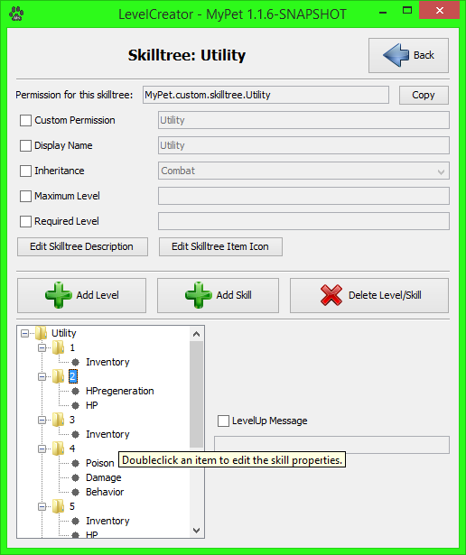

# SkilltreeCreator - Tool

The _SkilltreeCreator_ is a tool with which you can create skilltrees for pet quickly, easily and without experience. The _SkilltreeCreator_ is built into the plugin and doesn't has to be downloaded separately. Simply doubleclick the `MyPet.jar` and the _SkilltreeCreator_should start. Most parts of the _SkilltreeCreator_ should be self-explaining.

### SkilltreeCreator  

In the _SkilltreeCreator_ window you can create and delete skilltrees for certain pet-types and save the changes that were made. You can also change the order of the _skilltree_s

Attention! Empty _skilltree_s and level will not be saved and will be gone when you close this tool!

### LevelCreator

 

In the _LevelCreator_-window you can add level to the selected _skilltree_ and add skills to the selected level. You can also select a _skilltree_ from whick the selected _skilltree_ have to inherit.

Attention!: All made changes will only be saved if the `Save`-button in the _SkilltreeCreator_-window is clicked.

